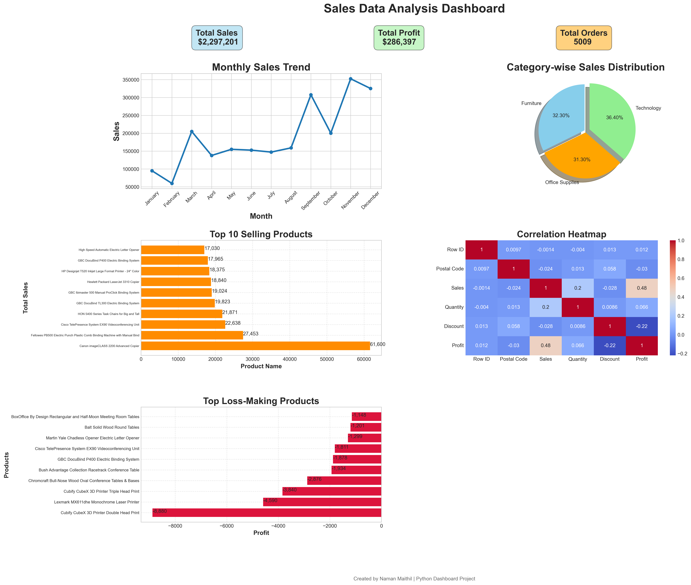

# Sales Data Anatysis Dashboard

## 📌 Project Overview

This project analyzes sales data using Python and visualizes important business insights through an interactive dashboard.

## 🚀 Tools & Libraries Used:

- Python
- Pandas
- Matplotlib
- Seaborn
- Jupyter Notebook

## 📊 Features

- Monthly Sales Trend Analysis
- Category-wise Sales Distribution
- Top Selling Products
- Correlation Heatmap
- Loss-Making Products Analysis
- KPI Cards (Sales, Profit, Orders)

## 📈 Key Insights

- Technology category generated the highest profit.
- Some products generated losses despite high sales.
- Discounts negatively impacted profitability.
- Monthly sales trends showed seasonal variation.

### 👨‍💻 Author 
Naman Maithil
